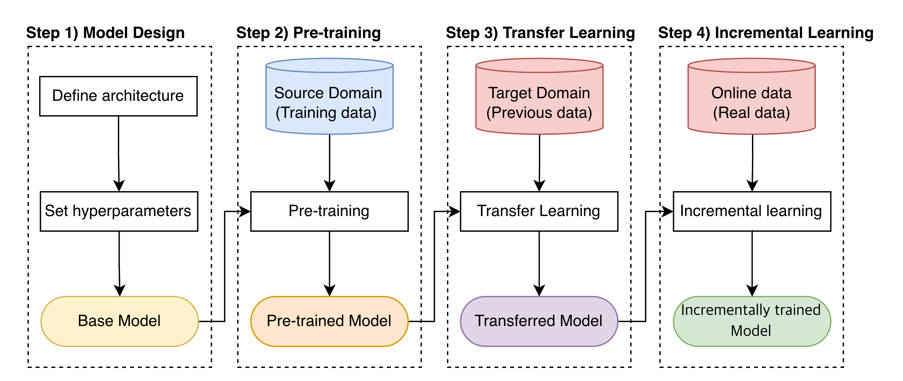
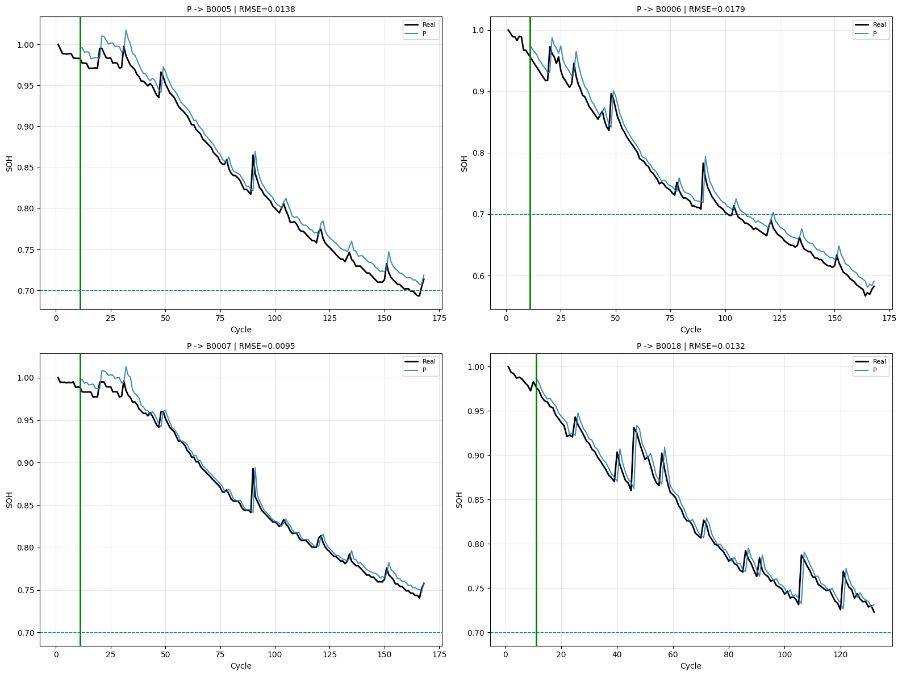
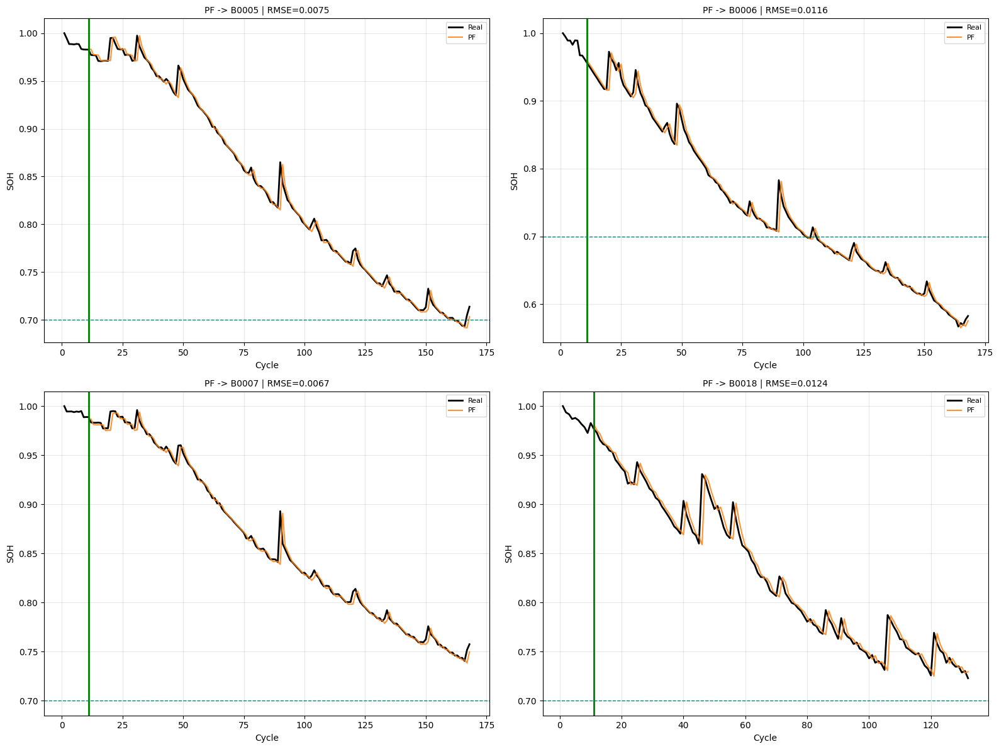

# LSTM 기반 배터리 SOH 예측 프레임워크

> **전이학습(Transfer Learning)** 을 활용한 리튬이온 배터리 SOH(State-of-Health) 예측

- CNN-LSTM 기반 딥러닝 프레임워크로 리튬이온 배터리 잔여 수명(RUL) 예측
- Edge BMS 환경의 데이터 부족 문제를 **Cross-domain 전이학습**으로 해결
- APISAT 2025 발표 논문 *"Intelligent Edge Battery Management System Using LSTM for RUL Estimation of Lithium-Ion Batteries"* 의 확장 구현

---

## 프레임워크

<p align="center">
  
</p>

| 단계 | 내용 | 설명 |
|:---:|------|------|
| **Step 1** | 모델 설계 | Conv1D-LSTM 기반 Delta-SOH 예측 모델 |
| **Step 2** | 사전학습 | Oxford 대규모 데이터셋으로 일반적 열화 패턴 학습 |
| **Step 3** | 미세조정 | NASA Target 도메인 데이터로 전이학습 |
| **Step 4** | 증분학습 | 실시간 운용 데이터로 온라인 모델 갱신 |

---

## 실험 결과

Oxford(Source) → NASA(Target) 전이학습으로 **RMSE 30% 개선** (LOOCV)

| 단계 | 설명 | B0005 | B0006 | B0007 | B0018 | 평균 RMSE |
|:---:|------|:---:|:---:|:---:|:---:|:---:|
| P | 사전학습만 | 0.0138 | 0.0179 | 0.0095 | 0.0132 | 0.0136 |
| PF | + 미세조정 | 0.0075 | 0.0116 | 0.0067 | 0.0124 | **0.0095** |

**사전학습만 적용 (P)**
<p align="center">
  
</p>

**미세조정 적용 (PF)**
<p align="center">
  
</p>

---

## 실행 방법

```bash
pip install -r requirements.txt
```

데이터셋은 [`data/README.md`](data/README.md) 참고

```bash
# Cross-domain 전이학습 (Oxford → NASA)
python -m experiments.run_cross_domain --finetune B0018 --test B0005

# Same-domain 예측 (NASA LOOCV)
python -m experiments.run_same_domain --test B0005
```

---

## 프로젝트 구조

```
├── src/
│   ├── config.py          # 하이퍼파라미터 및 경로 설정
│   ├── data_loader.py     # NASA & Oxford 데이터 로더
│   ├── preprocess.py      # 신호처리 & 특징 추출
│   ├── model.py           # Conv1D-LSTM 모델 정의
│   ├── trainer.py         # 사전학습 / 미세조정 / 증분학습
│   └── evaluate.py        # 평가 지표 & 시각화
├── experiments/
│   ├── run_cross_domain.py    # Cross-domain: Oxford → NASA
│   └── run_same_domain.py     # Same-domain: NASA LOOCV
├── data/                       # 데이터셋
├── docs/                       # 기술 문서 & 이미지
├── results/                    # 실험 결과 그래프
└── requirements.txt
```

상세 기술 문서: [`docs/TECHNICAL.md`](docs/TECHNICAL.md)
