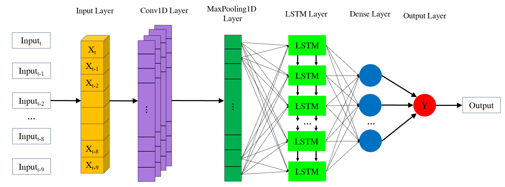
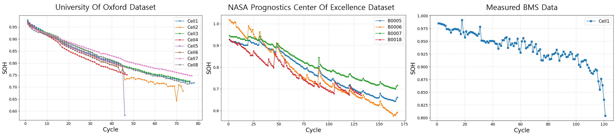
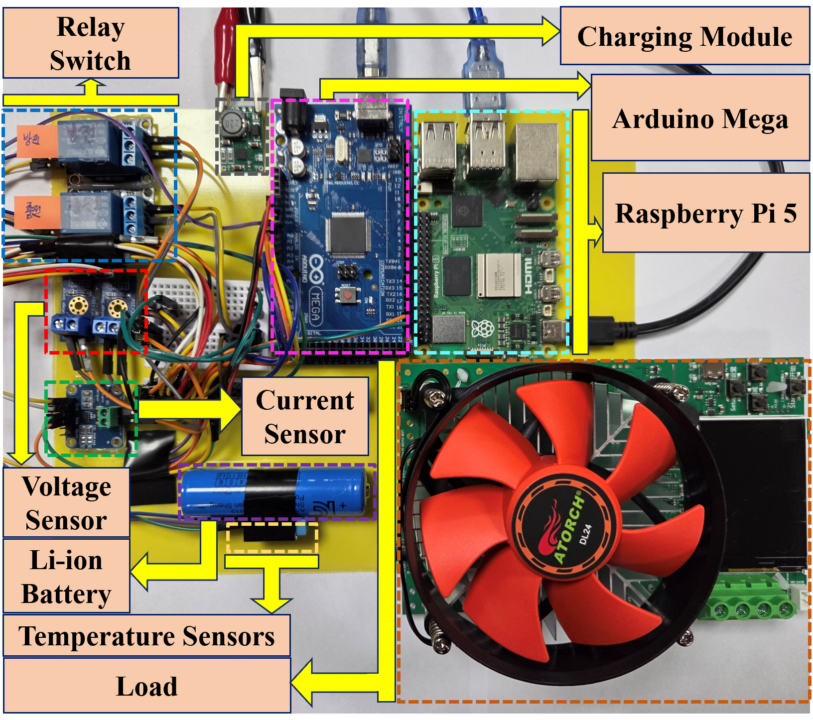

# 기술 문서

## 모델 구조

<p align="center">
  
</p>

| 파라미터 | 값 |
|----------|-----|
| Input Window | 10 사이클 |
| Feature Dimension | 151 (V×50 + I×50 + T×50 + Capacity) |
| Conv1D Filters | 32 (kernel=3) |
| LSTM Hidden Units | 24 |
| Dropout Rate | 0.25 |
| Loss Function | Huber Loss |

### 설계 포인트

- **Delta-SOH 예측** — 절대값 대신 변화량(Δ) 예측
- **Huber Loss** — 이상치에 강건한 손실함수
- **앙상블** — 반복 학습 후 평균으로 안정성 확보

---

## 데이터셋

<p align="center">
  
</p>

| 데이터셋 | 역할 | 배터리 | 사이클 수 |
|----------|------|--------|----------|
| [Oxford Battery Degradation](https://ora.ox.ac.uk/objects/uuid:03ba4b01-cfed-46d3-9b1a-7d4a7bdf6fac) | Source Domain (사전학습) | Cell 1-8 | 각 ~100 |
| [NASA PCoE](https://www.nasa.gov/intelligent-systems-division/discovery-and-systems-health/pcoe/pcoe-data-set-repository/) | Target Domain (미세조정/평가) | B0005, B0006, B0007, B0018 | 각 ~170 |

### 전처리 파이프라인

1. **신호 분할** — 충방전 사이클에서 전압(V), 전류(I), 온도(T) 신호 추출
2. **구간 평균** — 각 신호를 50개 구간으로 분할하여 구간 평균값 계산
3. **특징 벡터** — V(50) + I(50) + T(50) + Capacity(1) = 151차원
4. **시퀀스 구성** — 최근 10 사이클의 특징 벡터를 입력으로 사용

---

## BMS 하드웨어

<p align="center">
  
</p>

- Raspberry Pi 5 + Arduino Mega 기반 실제 BMS 구성
- 전압, 전류, 온도 데이터 실시간 수집

---

## 학습 파이프라인 상세

### Step 2: 사전학습 (Pre-training)

- Oxford 8개 배터리 데이터로 학습
- Learning Rate: 2e-3
- Max Epochs: 120 (EarlyStopping patience=15)
- 일반적 열화 패턴을 학습하여 초기 가중치 확보

### Step 3: 미세조정 (Fine-tuning)

- NASA Target 배터리 데이터로 전이학습
- Learning Rate: 3e-3
- Max Epochs: 160 (EarlyStopping patience=12)
- Source(Oxford) → Target(NASA) 도메인 차이 보상

### Step 4: 증분학습 (Incremental Learning)

- 슬라이딩 윈도우 기반 온라인 업데이트
- Learning Rate: 1e-3
- 윈도우 크기: 30 사이클, 갱신 주기: 5 사이클마다
- Dense 레이어만 학습 가능 (Conv1D, LSTM은 동결)

---

## 실험 설정

### Cross-domain 전이학습 (S1)

- Oxford 사전학습 → NASA 단일 배터리 미세조정 → 나머지 배터리 평가
- NASA 4개 배터리 LOOCV (Leave-One-Out Cross-Validation)
- 12개 (학습, 테스트) 조합에 대해 테스트 배터리별 평균 RMSE 산출

### 평가 지표

- **RMSE** (Root Mean Square Error) — 주요 지표
- **MAE** (Mean Absolute Error)
- **MAPE** (Mean Absolute Percentage Error)

---

## 프로젝트 구조 상세

```
├── src/
│   ├── config.py          # 하이퍼파라미터 및 경로 설정
│   ├── data_loader.py     # NASA & Oxford 데이터 로더
│   ├── preprocess.py      # 신호처리 & 특징 추출
│   ├── model.py           # Conv1D-LSTM 모델 정의
│   ├── trainer.py         # 사전학습 / 미세조정 / 증분학습 파이프라인
│   └── evaluate.py        # 평가 지표 (RMSE, MAE, MAPE) & 시각화
├── experiments/
│   ├── run_cross_domain.py      # Cross-domain: Oxford → NASA
│   └── run_same_domain.py       # Same-domain: NASA LOOCV
├── data/                        # 데이터셋 (data/README.md 참고)
├── docs/
│   ├── TECHNICAL.md             # 본 문서
│   └── images/                  # 다이어그램 및 이미지
├── results/                     # 실험 결과 그래프
└── requirements.txt
```
